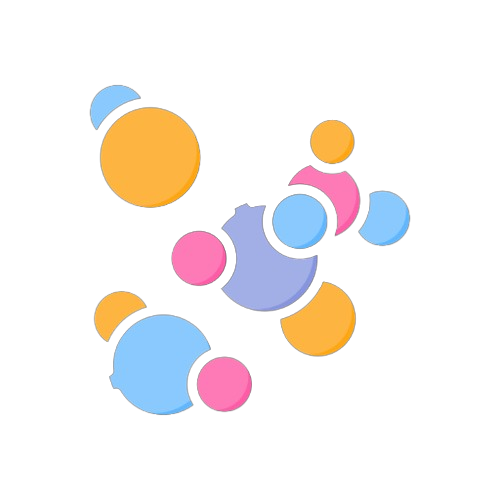
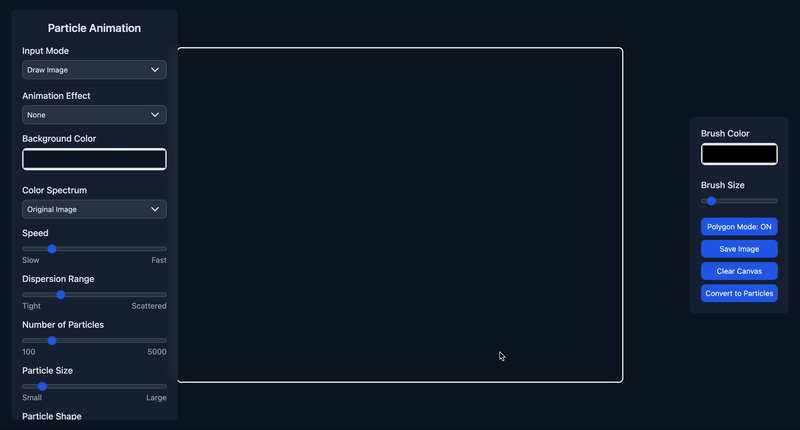
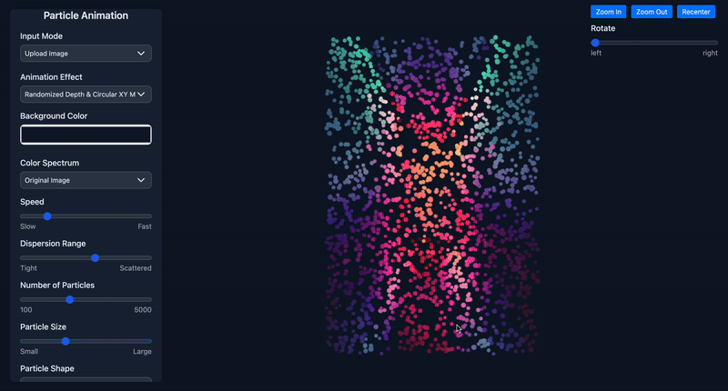

# ParticleViz 

An interactive web application that converts images into dynamic particle animations with customizable effects and export capabilities.

## Features

### Input Methods
- **Image Upload**: Drag & drop or select images to convert
- **Drawing Mode**: Create custom drawings with two modes:
  - Freehand drawing
  - Polygon drawing tool
    

### Animation Effects
- 360 Rotation: auto rotate the particle visualization in a 360 degree loop
  
- Randomized Depth & Circular XY Movement: allow particles to float between closer and farther depths while also travelling in a circular pattern along the XY plane
  

### Particle Customization
- Color spectrum options (original, grayscale, random)
- Control over particle: size, speed, dispersion, opacity, count (100 - 5000), shape (circle, square, star)

### Particle Link Customization
- Control over particle link: count, opacity, color
  

### Background Color Customization
- Control over animation background color

### Configuration Import & Export
Using the 'Load Config' and 'Save Config' buttons you can save and export the below customizations and reimport them when desired:
* particle color
* particle opacity
* particle speed
* particle dispersion
* particle count
* particle size
* particle shape
* animation effect
* particle link count
* particle link opacity
* particle link color
* animation background color

### Canvas Controls
- Zoom in/out functionality
- Canvas recentering
- Panning/dragging
  

### Export Options
- Export as GIF, HTML, WEBM, MP4, Frames
- Control over animation recording length
- Device-specific sizing:
  - Desktop (1920x1080)
  - Mobile (375x667)
  - Smartwatch (320x320)


## Access the App

The most recent release is available at https://github.com/Rezar/ParticleViz as an electron app. <br/>
The following architectures are currently supported:
- Linux ARM64
- Mac ARM64
- Windows

We are hoping to soon release it as a web app on Github pages as well.

## Usage

1. **Access Methods**: 
    - Access the app via the above documented sources (currently only released as an electron app)

2. **Input Methods**:
   - Upload an image by dragging and dropping or using the file selector
   - Switch to drawing mode to create custom images
   - Use polygon mode for precise shape creation

3. **Customize Animation**:
   - Adjust particle properties using the control panel
   - Experiment with different color modes
   - Fine-tune animation speed and dispersion

4. **Export**:
   - Click "Create GIF" to open export options
   - Choose export format (GIF/HTML/WEBM/MP4/Frames) and animation duration
   - Select target device dimensions
   - Wait for processing and download

## Running Locally & Contributing 

1. Clone the repository:
```
git clone https://github.com/Rezar/ParticleViz
cd ParticleViz
```

2. Download live-server if you dont already have it
```
npm install -g live-server
```
3. Run live server from the base of the repo
```
live-server
```

4. Make any changes to the code as you see fit.
5. Contributions are welcome! Please feel free to submit a Pull Request with your changes.

## Acknowledgments

- [gif.js](https://github.com/jnordberg/gif.js) library for GIF creation
- [flaticon](https://www.flaticon.com/free-icons/particles) Logo
